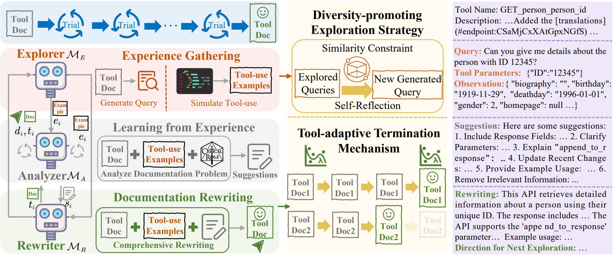

<h1 align="center">🛠️🤖 From Exploration to Mastery:
<br>
Enabling LLMs to Master Tools via Self-Driven Interactions

</h1>
<p align="center">
  <a href="#-quick-start"><b>[Quick Start]</b></a> •
  <a href="https://arxiv.org/pdf/2410.08197"><b>[Paper]</b></a> •
  <a href="#%EF%B8%8F-citation"><b>[Citation]</b></a>
</p>

Repo for the paper "[From Exploration to Mastery:Enabling LLMs to Master Tools via Self-Driven Interactions](https://arxiv.org/abs/2410.08197)" [ICLR'25 Oral]

## 🔥 News

- [2025/2/24] We release all the code for DRAFT.
- [2025/2/11] DRAFT is selected to be presented as an Oral (1.8%).
- [2025/1/23]  DRAFT is accepted by [**ICLR 2025**](https://iclr.cc/).
- [2024/10/10] Our [**paper**](https://arxiv.org/abs/2410.08197) and code is released.

## 💡 Introduction

DRAFT is designed to dynamically adjust and optimize tool documentation based on the interaction feedback between LLMs and external tools, which significantly bridges the gap between them by enabling the LLMs to better comprehend and utilize the tools at their disposal, thereby enhancing the overall tool-using capabilities of LLMs.

<p align="center">
    
</p>

> Humans, acquire tool proficiency through repeated interactions and hands-on experiences, capable of maintaining an updated comprehension of these tools despite their evolving functionalities. In light of this, we propose DRAFT, conceptualized to automate the adjustment and optimization of tool documentation based on the feedback derived from the LLM's interaction with the tool.

## 🛠️ Setup

### Environment Setup


Our experimental environment is shown below:

```
openai version: 0.28.0
numpy version: 1.26.4
pandas version: 2.2.2
torch version: 2.3.1
```

### API Key Setup

Get OpenAI key from [OpenAI](https://platform.openai.com/playground/chat), RapidAPI key from [RapidAPI](https://rapidapi.com/hub) or ToolBench key from [ToolBench](https://github.com/OpenBMB/ToolBench) repo, TMDB key from [TMDB](https://developer.themoviedb.org/reference/intro/getting-started), and Spotify key from [Spotify](https://developer.spotify.com/documentation/web-api).

### Data Setup

You can download ToolBench dataset from the [Google Drive](https://drive.google.com/drive/folders/1yBUQ732mPu-KclJnuQELEhtKakdXFc3J) and RestBench dataset from [RestBench](https://github.com/Yifan-Song793/RestGPT) repo, then extract all tool documentation. Alternatively, you can directly use our preprocessed tool documentation.

## 🚀 Quick Start

### DRAFT

Run `DRAFT` to get revised tool documentation:

> python DRAFT.py

### Inference

Run `Inference_DFSDT` to perform inference using the tool documentation modified by DRAFT to examine the effectiveness of DRAFT.

> python Inference\_DFSDT -model\_name gpt-4o-2024-08-06 -data\_type G3 -method DRAFT

You can specify the model, dataset, and method by cmd line arguments.
### Evaluation

Run `Cal_path_rate` to calculate the path rate for evaluating the results.

> python Cal_path_rate.py

We use the official code provided by ToolBench to calculate the win rate. You can find the calculation method in the [ToolEval](https://github.com/OpenBMB/ToolBench/blob/master/toolbench/tooleval/README.md) repo.


## ☕️ Citation
If you find our code or work useful for your research, please cite our work.
```
@inproceedings{
  quexploration,
  title={From Exploration to Mastery: Enabling LLMs to Master Tools via Self-Driven Interactions},
  author={Qu, Changle and Dai, Sunhao and Wei, Xiaochi and Cai, Hengyi and Wang, Shuaiqiang and Yin, Dawei and Xu, Jun and Wen, Ji-Rong},
  booktitle={The Thirteenth International Conference on Learning Representations},
    year={2025},
    url={https://openreview.net/forum?id=QKBu1BOAwd}
}
```
